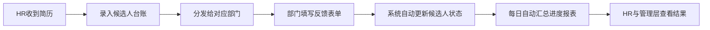

# 招聘提效方案

## 一、当前业务流程

1. HR 收到候选人简历。
2. HR 将简历发送给对应部门负责人或面试官。
3. 各部门分别反馈筛选结果、面试结果或是否继续推进。
4. HR 每天手动汇总所有候选人的当前进度，更新表格并同步给管理层。

## 二、当前流程的核心问题

### 1. 信息分散

候选人简历、部门反馈、面试结果分散在微信、邮件、Excel 中，缺少统一记录入口。

### 2. 跟进成本高

HR 需要反复催促各部门给结果，还要手动整理候选人状态，耗时长、效率低。

### 3. 数据容易出错

人工复制和汇总候选人流程节点时，容易出现遗漏、重复、状态不同步等问题。

### 4. 管理透明度不足

管理层无法实时看到每位候选人当前卡在哪个环节，也无法快速判断部门反馈效率。

## 三、待解决问题

在最小成本预算下，设计一套可快速落地的招聘流程跟踪方案，实现：

- 简历统一登记
- 部门反馈统一回收
- 候选人流程状态自动更新
- 每日自动输出候选人进展汇总

## 四、低成本落地方案

### 方案思路

以“统一台账 + 自动提醒 + 自动汇总”为核心，搭建轻量化招聘流程管理方案。

### 具体做法

#### 1. 建立统一候选人台账

由 HR 在候选人进入流程时统一录入基础信息：

- 候选人姓名
- 应聘岗位
- 简历来源
- 推荐日期
- 当前流程状态
- 对接部门
- 部门负责人
- 最新反馈结果
- 下一步动作
- 最后更新时间

所有候选人数据统一沉淀到一张在线表格或轻量系统中。

#### 2. 建立部门反馈入口

HR 将简历分发给部门后，部门负责人通过统一链接或表单提交反馈：

- 是否通过初筛
- 是否安排面试
- 面试结果
- 是否进入下一轮
- 不通过原因
- 反馈时间

这样可以避免口头反馈、聊天记录分散的问题。

#### 3. 自动更新候选人状态

当部门提交反馈后，系统自动将候选人状态更新为对应节点，例如：

- 待部门筛选
- 筛选通过
- 待一面
- 一面通过
- 待二面
- 已录用
- 已淘汰

减少 HR 手工维护流程状态的工作量。

#### 4. 每日自动汇总招聘进度

系统每天定时汇总候选人流程数据，自动生成日报，包括：

- 今日新增候选人数
- 各流程阶段人数分布
- 待反馈候选人数
- 超时未处理候选人数
- 已录用/已淘汰人数
- 每位候选人的当前进展明细

HR 只需要查看和补充异常情况，不需要再手工汇总。

## 五、推荐的最小化实施方式

如果预算有限，可采用以下轻量组合：

- 在线表格：作为招聘主台账
- 在线表单：作为部门反馈入口
- 自动化工具：用于状态同步、提醒和日报推送
- 企业微信或飞书机器人：用于发送每日汇总和催办通知

## 六、优化后的目标流程

## 七、最终实现目标

### 1. 提升效率

将 HR 从“收集信息、复制粘贴、手工汇总”中解放出来，把更多精力放在沟通和招聘决策上。

### 2. 保证数据实时同步

所有部门反馈统一进入一个入口，候选人进度自动更新，避免数据滞后。

### 3. 提高过程透明度

随时查看每位候选人当前处于哪个阶段、卡在哪个部门、停留了多久。

### 4. 支撑管理决策

通过日报和流程数据沉淀，管理层可以及时掌握招聘进展和瓶颈环节。

## 八、适合你在面试里讲的一段话

这个场景的核心不是做一个复杂的招聘系统，而是先用最小成本解决 HR 手工记录、部门反馈分散、每日汇总低效这三个问题。我的方案是先搭建一个统一候选人台账，再提供一个标准化的部门反馈入口，通过自动化规则把反馈结果同步成候选人的流程状态，最后每天自动生成招聘进度汇总。这样既能快速落地，也能明显提升招聘流程的透明度和协同效率。
